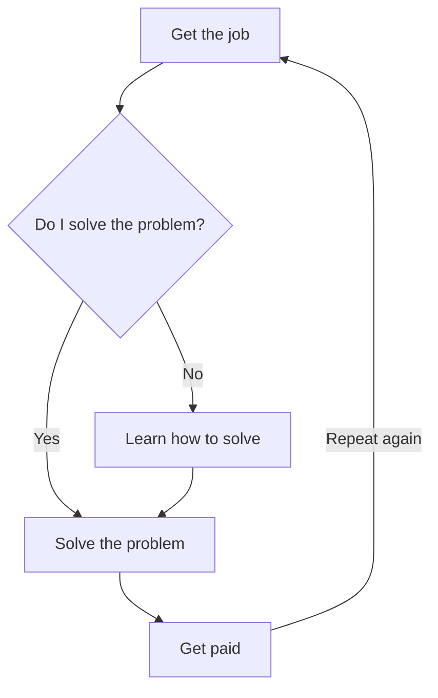

  <h1> Hello Everyone, This is Kerem!</h1>
  
Software Engineering Pleb | Storyteller with Visuals | Obsessed with ML & IoT 

  

---

### 👨‍🎓 About Me

  

---
### 🌀 Work Cycle

---

### 💻 Skills

#### Languages & Tools

  
  
  
  
  

---

### 🛠️Projects

| Project Name              | Description                                                                                                         | Tech Used             | Demo / Screenshot                                                                                          |
|--------------------------|---------------------------------------------------------------------------------------------------------------------|-----------------------|------------------------------------------------------------------------------------------------------------|
| [**Library Management System**](https://github.com/KeremErkut/LibraryManagementSystem) | A desktop application built with Java Swing and MySQL featuring role-based authentication, book/category CRUD, and advanced search. | Java, Swing, MySQL    |  |
| [**DeveloperSözlük**](https://github.com/KeremErkut/DeveloperSozluk)       | An interactive dictionary and discussion platform for developers built with Django. Allows topic creation, entry posting, and user management. | Django 5.2, Python 3, Bootstrap 5 |  |

---

### 📈 GitHub Highlights

  
  

  
  

---
### 📬 Contact with Me

  
  
  
  

---

  

---

*🌟 Fun Fact: I might not be the coolest software engineering student... but I'm close!*
